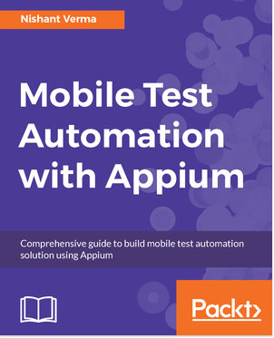
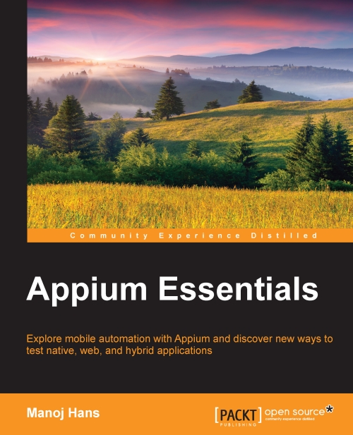

<a href="https://www.packtpub.com/application-development/mobile-test-automation-appium" class="resource-title">Mobile Test Automation with Appium</a> 
Nishant Verma 
June 2017, <a href="https://www.packtpub.com/">Packt Publishing</a> 
Automate your mobile app testing.

<a href="https://www.packtpub.com/application-development/appium-essentials/?utm_source=POD&utm_medium=referral&utm_campaign=1784392480" class="resource-title">Appium Essentials</a> 
Manoj Hans 
April 2015, <a href="https://www.packtpub.com/">Packt Publishing</a> 
Explore mobile automation with Appium and discover new ways to test native, web, and hybrid applications.

